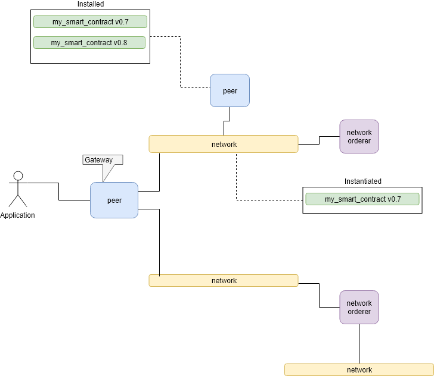

## Running Build Papernet

After reading the topic on how to 'Build Papernet' this document will take you through a tutorial on doing this with Fabric.

Prereqs:  
- Read the topic in the docs
- Pulled down the latest docker fabric binaries
- Some familiarty with the Linux commad line
- Cup of tea

### Recap on what we are building

Something along the following pattern.

## Define the network orderder

Role: SCC
Organsizations: SCC

## Add Org

## Add Peer

Repeat....
